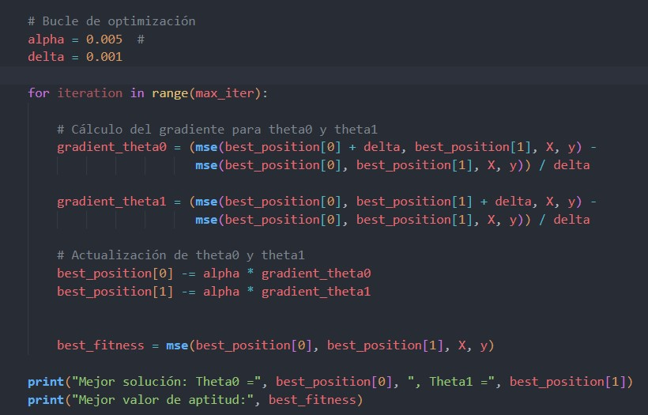
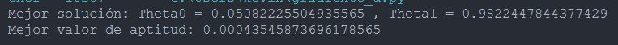
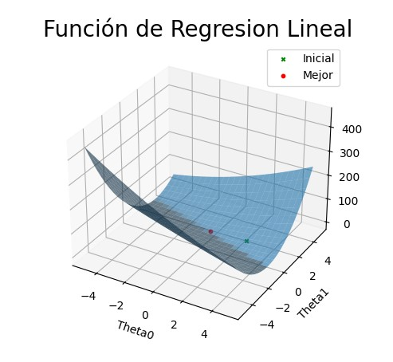

<h1>Practica 4: Implementación del algoritmo gradiente descendente para aplicarlo a la resolución de la función MSE de una regresión lineal.

Materia: Sem. Sistemas Basados en Conocimiento

Profesor: Jorge De Jesus Galves Rodriguez

Fecha: 11/10/23

Duarte Vázquez Kevin Alexis. </h1>

<h2> Resultados:</h2>

<h3> Bucle Principal - Gradiente Descendiente:</h3>

<h3> Mejor Resultado:</h3>

<h3> Grafica:</h3>

